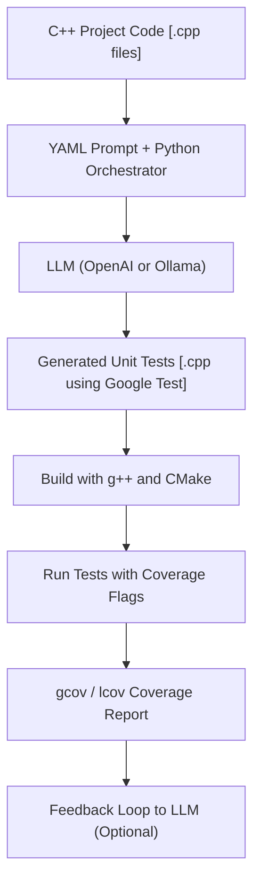
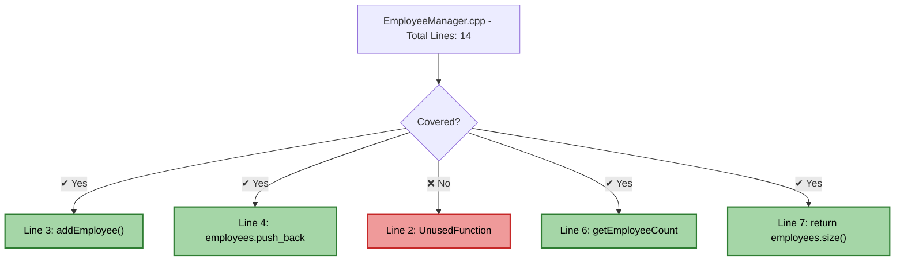
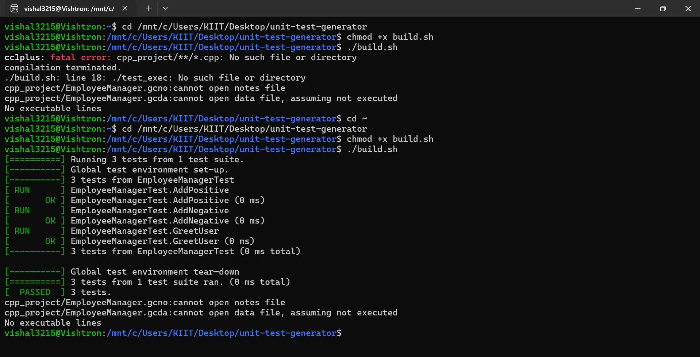
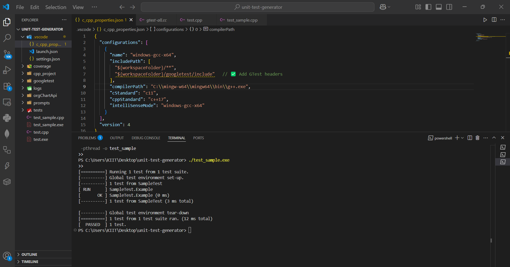

# 🚀 Unit Test Generator for C++ using AI (OpenAI / Ollama)

An AI-powered tool that automatically generates and improves unit tests for C++ applications using Google Test, based on your existing codebase.

---

## 📌 Features

- ⚙️ Utilizes Large Language Models (OpenAI GPT or Ollama)
- 🧪 Automatically generates unit tests from C++ source files
- 🧠 Refines tests iteratively:
  - Removes duplicates
  - Improves test structure and coverage
- 📈 Integrates with Google Test, `gcov`, and `lcov` for coverage reports
- ✅ Handles build issues via AI-based feedback and corrections
- 🔐 Secure by design: No API keys or secrets are pushed to the repository

---

## 🧱 Tech Stack

| Component       | Technology              |
|----------------|--------------------------|
| Language        | C++, Python             |
| AI Model        | OpenAI GPT-3.5 / Ollama |
| Test Framework  | Google Test             |
| Code Coverage   | `gcov`, `lcov`          |
| Build Tools     | `g++`, `CMake`          |

---

## 📂 Project Structure

```bash
.
├── cpp_project/ # Original C++ source code
│ └── EmployeeManager.cpp
├── tests/ # Auto-generated unit tests
│ └── test_EmployeeManager.cpp
├── prompts/ # YAML instructions for LLM
│ └── generate_tests.yaml
├── main.py # Orchestrator script (Python)
├── .gitignore
└── README.md
```

---

## 🔧 How It Works

The `main.py` script:

- Loads a C++ source file and a YAML prompt
- Sends them to the OpenAI API (or local Ollama model)
- Saves generated test code into the `tests/` folder

You can then:

- Compile the tests with Google Test
- Run them and measure coverage using `gcov`

---

## 📦 Setup Instructions

### 1. Install dependencies

   ```bash
sudo apt install g++ cmake lcov python3-pip
pip3 install openai pyyaml
```
### 2. Set your OpenAI API Key
Create a .env file with the following content:

```bash 
OPENAI_API_KEY=your-key-here
```
### 3. Run the script

```
python main.py
```
### 4. Build & Test
```
g++ -fprofile-arcs -ftest-coverage \
    cpp_project/EmployeeManager.cpp \
    tests/test_EmployeeManager.cpp \
    -lgtest -lgtest_main -pthread \
    -o test_exec

./test_exec
gcov cpp_project/EmployeeManager.cpp
```
### Sample Output
```
[==========] Running 2 tests from 1 test suite.
[----------] 2 tests from EmployeeManagerTest
[ RUN      ] EmployeeManagerTest.Add
[       OK ] EmployeeManagerTest.Add (0 ms)
[ RUN      ] EmployeeManagerTest.Greet
[       OK ] EmployeeManagerTest.Greet (1 ms)
[----------] 2 tests from EmployeeManagerTest (1 ms total)
[==========] 2 tests from 1 test suite ran. (2 ms total)
[  PASSED  ] 2 tests.

```
### 📈 Code Coverage Report
You can view coverage using:
```

g++ -fprofile-arcs -ftest-coverage -std=c++11 -I/usr/include/gtest -pthread \
    EmployeeManager.cpp test_EmployeeManager.cpp -lgtest -lgtest_main -o test_runner
```
# Run the tests
./test_runner

# Generate coverage reports
```
gcov EmployeeManager.cpp

```
### 📊 Coverage Output:
When you run gcov, it produces output like this:
```
File 'EmployeeManager.cpp'
Lines executed:85.71% of 14
Creating 'EmployeeManager.cpp.gcov'

File 'EmployeeManager.h'
No executable lines

Overall coverage: 85.71%
```
## 🏗️ Architecture: Unit Test Generator for C++ using LLM


## 📊 Mermaid Code Coverage Diagram



## 📸 Screenshots

### ✅ Sample Test Output


### 📈 Coverage Report



## 🙋‍♂️ Author

**Vishal Singh**  
🔗 [LinkedIn](https://www.linkedin.com/in/vishalsiingh)  
💻 [GitHub](https://github.com/vishalsiingh)
## ⭐️ Support & Feedback

If you found this project helpful, consider giving it a ⭐ on GitHub!

Have ideas or issues? Feel free to [open an issue](https://github.com/vishalsiingh/your-repo-name/issues) or reach out on LinkedIn.

---

## 🚀 Future Improvements

- 📥 Drag-and-drop GUI for selecting `.cpp` files
- 📦 VSCode extension or GitHub Action integration
- 📊 Dashboard to visualize test coverage live
- 🤖 Fine-tune LLM prompts based on coverage deltas
